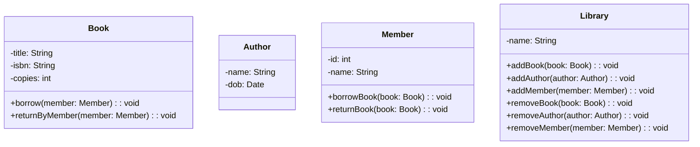
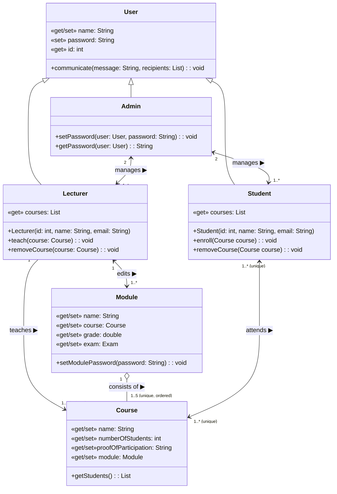
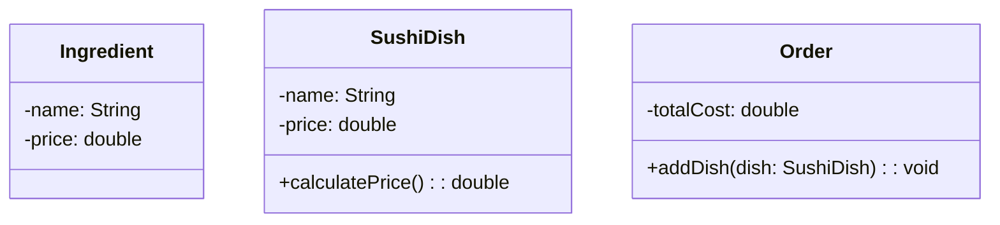

# Übungsblatt: Modellierung (z.B., UML-Klassen- und Sequenzdiagramm)
[Link to English version](./README_en.md)

In diesem Übungsblatt lernen Sie, UML-Klassendiagramme und Sequenzdiagramme zu lesen und zu schreiben, um Programmierprojekte zu modellieren.

**Hinweise:**
* Ich empfehle die Verwendung der [Mermaid Markdown-Erweiterung](https://mermaid.js.org/syntax/classDiagram.html), um UML-Diagramme direkt in Markdown zu zeichnen.
    * Siehe z.B. [die UML-Diagramme](#uml-klassendiagramm) in dieser README-Datei
* Anstatt alle Getter und Setter zu den Klassen hinzuzufügen, können Sie eine eigene Konvention verwenden, um die entsprechenden Felder zu markieren, z.B.,
    * `«get/set»` kennzeichnet ein privates Feld mit `public` Get- und Set-Methoden.
    * `«get»` kennzeichnet ein privates (`readonly`) Feld mit einem `public` Get-Methode.

## Übung: Bibliotheksverwaltungssystem (Library Management System)

Ihre Aufgabe ist es, ein Bibliotheksverwaltungssystem mithilfe von objektorientierten Programmierprinzipien in Java zu entwerfen.
Das System sollte in der Lage sein, Informationen über Bücher (`book`), Autor&ast;innen (`author`), Bibliotheksmitglieder (`member`) und die Bibliothek (`library`) zu speichern.

Jedes Buch sollte einen Titel, eine ISBN, eine geordnete Menge von Autor&ast;innen und die Anzahl der verfügbaren Exemplare haben.
Jede&ast;r Autor&ast;in sollte einen Namen, ein Geburtsdatum und eine sortierte Menge von Büchern, die sie/er geschrieben hat, haben.
Jede Bibliothek kann beliebig viele Mitglieder haben. Jedes Mitglied kann Mitglied von mehreren Bibliotheken sein.
Jedes Mitglied sollte einen Namen, eine eindeutige ID und eine Menge von Büchern, die sie/er ausgeliehen hat, haben.
Das System sollte auch mehrere Bibliotheken verwalten können, jede mit ihrer eigenen Sammlung von Büchern, Autor&ast;innen und Mitgliedern.

### Aufgaben

1. Fügen Sie dem untenstehenden Klassendiagramm die notwendigen Beziehungen zwischen den Klassen mit UML-Notation hinzu. Achten Sie auf Rollen, Multiplizitäten und Beschreibungen. Laden Sie Ihre Antworten entweder in einer Markdown-Datei `library_management.md` oder als PDF-Datei `library_management.pdf` im Hauptverzeichnis hoch.
    * Bonus: Verwenden Sie die [`Mermaid` Markdown-Erweiterung](https://mermaid.js.org/syntax/classDiagram.html), um das Klassendiagramm direkt in Markdown zu zeichnen.
2. Implementieren Sie die Klassen für `Book`, `Author`, `Member` und `Library` in Java im Paket `de.phl.programmingproject.librarymanagement`. Jede Klasse sollte geeignete Konstruktoren, Getter und Setter haben.
    * **Beachten Sie**, dass auch die Beziehungen implementiert werden müssen.
3. Erstellen Sie eine `main`-Methode in der `Main`-Klasse, um Ihr Bibliotheksverwaltungssystem zu testen. Erstellen Sie in Ihrem Test einige Bibliotheken, Bücher, Autor&ast;innen und Mitglieder und führen Sie einige Ausleih- und Rückgabeoperationen durch.

### UML-Klassendiagramm




## Übung: Studierendenverwaltungssystem (Student Enrollment System; UML-Klassendiagramm-Modellierung mit Fokus auf Assoziationen)

Ihre Aufgabe ist es, ein Studierendenverwaltungssystem mithilfe von objektorientierten Programmierprinzipien in Java zu entwerfen.

Das System sollte in der Lage sein, Informationen über Nutzer&ast;innen (Admins, Studierende, Dozierende), Kurse, Module und Noten zu speichern.

### Aufgaben

1. Implementieren Sie anhand des untenstehenden Klassendiagramms die Java-Klassen für `User`, `Student`, `Lecturer`, `Course`, `Module`, `Admin` und `UniversityAdministration` im `de.phl.programmingproject.enrollmentsystem` Paket.
    * Jede Klasse sollte geeignete Konstruktoren, Getter und Setter haben.
    * Achten Sie besonders auf die Implementierung der Assoziationen.
2. Erstellen Sie eine Hauptmethode, um Ihr Studentenverwaltungssystem zu testen.

Zur Klarstellung, falls es im UML-Diagramm nicht sichtbar ist, sind hier die Anforderungen für die Assoziationen aufgelistet:
* Ein Admin kann mehrere Studierende verwalten. Ein&ast;e Studierende&ast;r kann von zwei Admins verwaltet werden.
* Ein Admin kann mehrere Dozierende verwalten. Ein&ast;e Dozent&ast;in kann von zwei Admins verwaltet werden.
* Ein&ast;e Studierende&ast;r kann mehrere Kurse besuchen und ein Kurs kann mehrere Studierende haben.
    * Studierende können denselben Kurs nicht zweimal besuchen.
* Ein&ast;e Dozent&ast;in kann mehrere Kurse unterrichten, aber ein Kurs kann nur von einer&ast;m Dozent&ast;in unterrichtet werden.
    * Die von einer&ast;m Dozent&ast;in zu unterrichtenden Kurse sind geordnet.
* Ein Modul besteht genau aus 5 Kursen und ein Kurs kann nur Teil eines Moduls sein.
    * Die Kurse in einem Modul sind geordnet und können nicht doppelt vorkommen.
* Ein&ast;e Dozent&ast;in kann mehrere Module bearbeiten, aber ein Modul kann nur von einer&ast;m Dozent&ast;in bearbeitet werden.



## Übung: Sushi-Bestellsystem (Sushi Ordering System)

Ihre Aufgabe ist es, ein Sushi-Bestellsystem mithilfe von objektorientierten Programmierprinzipien in Java zu entwerfen.
Das System sollte in der Lage sein, Informationen über die verfügbaren Sushi-Gerichte (`SushiDish`) und die Zutaten (`Ingredient`), die zur Herstellung verwendet werden, zu speichern.

Jedes Sushi-Gericht sollte aus einer oder mehreren Zutaten und einem Preis bestehen.
Das System sollte auch in der Lage sein, die Gesamtkosten einer Bestellung (`Order`) auf der Grundlage der ausgewählten Gerichte zu berechnen.
Darüber hinaus sollte das System mehrere Restaurants verwalten können, jedes mit seiner eigenen Auswahl an Sushi-Gerichten und Zutaten.
Im Restaurant können Bestellungen aufgegeben werden. Jede Bestellung besteht aus mindestens einem Gericht, wobei das gleiche Gericht mehrmals pro Bestellung erlaubt ist.

### Aufgaben

1. Fügen Sie dem untenstehenden Klassendiagramm die notwendigen Beziehungen zwischen den Klassen mit UML-Notation hinzu.
2. Aktualisieren Sie das Klassendiagramm, um eine `Restaurant`-Klasse einzufügen, die einen Namen und eine Liste von Sushi-Gerichten und Zutaten hat. Fügen Sie die notwendigen Assoziationen zwischen den Klassen hinzu, um dies widerzuspiegeln.
3. Eine wichtige Zutat für Sushi ist Reis. Diskutieren Sie, ob eine solche Einschränkung (`constraint`) direkt in UML-Klassendiagrammen modelliert werden kann.
4. Laden Sie Ihre Lösung als Markdown-Datei `sushi_ordering_system.md` oder als PDF-Datei `sushi_ordering_system.pdf` im Hauptverzeichnis hoch.
    * Bonus: Verwenden Sie die [`Mermaid` Markdown-Erweiterung](https://mermaid.js.org/syntax/classDiagram.html), um das Klassendiagramm direkt in Markdown zu zeichnen.

### UML-Klassendiagramm



## Übung: Bankwesen (UML-Klassendiagramm-Modellierung)

In dieser Übung werden Sie ein einfaches Bankensystem mit UML-Klassendiagrammen modellieren.
Sie haben die folgenden Java-Klassen erhalten (auch verfügbar im Paket `de.phl.programmingproject.banking`):

```java
public abstract class BankAccount {
    private final int accountNumber;
    private final Holder accountHolder;
    private double balance;
    
    public BankAccount(final int accountNumber, final Holder accountHolder, final double balance) {
        this.accountNumber = accountNumber;
        this.accountHolder = accountHolder;
        this.balance = balance;
    }
    
    public int getAccountNumber() {
        return accountNumber;
    }
    
    public Holder getAccountHolder() {
        return accountHolder;
    }
    
    public double getBalance() {
        return balance;
    }

    protected void setBalance(final double balance) {
        this.balance = balance;
    }
    
    public abstract void deposit(final double amount) throws IllegalArgumentException;
    
    public abstract void withdraw(final double amount) throws IllegalArgumentException;
}

public class SavingsAccount extends BankAccount {
    private final double interestRate;
    
    public SavingsAccount(final int accountNumber, final Holder accountHolder, final double balance, final double interestRate) {
        super(accountNumber, accountHolder, balance);
        this.interestRate = interestRate;
    }
    
    public double getInterestRate() {
        return interestRate;
    }
    
    public double calculateInterest() {
        return getBalance() * interestRate;
    }
    
    @Override
    public void withdraw(final double amount) throws IllegalArgumentException {
        if (getBalance() - amount < 0) {
            throw new IllegalArgumentException("Withdrawal amount exceeds balance.");
        }
        setBalance(getBalance() - amount);
    }

    @Override
    public void deposit(double amount) throws IllegalArgumentException {
        if (amount < 0) {
            throw new IllegalArgumentException("Deposit amount must be positive.");
        }
        setBalance(getBalance() + amount);
    }
}

public class CheckingAccount extends BankAccount {
    private final double overdraftLimit;
    
    public CheckingAccount(final int accountNumber, final Holder accountHolder, final double balance, final double overdraftLimit) {
        super(accountNumber, accountHolder, balance);
        this.overdraftLimit = overdraftLimit;
    }
    
    public double getOverdraftLimit() {
        return overdraftLimit;
    }
    
    @Override
    public void withdraw(final double amount) throws IllegalArgumentException {
        if (getBalance() - amount < -overdraftLimit) {
            throw new IllegalArgumentException("Withdrawal amount exceeds overdraft limit.");
        }
        setBalance(getBalance() - amount);
    }

    @Override
    public void deposit(double amount) throws IllegalArgumentException {
        if (amount < 0) {
            throw new IllegalArgumentException("Deposit amount must be positive.");
        }
        setBalance(getBalance() + amount);
    }
}

public class Bank {
    private final String name;
    private final Set<BankAccount> accounts;
    private final Set<Holder> holders;
    
    public Bank(final String name) {
        this.name = name;
        this.accounts = new HashSet<>();
        this.holders = new HashSet<>();
    }
    
    public String getName() {
        return name;
    }
    
    public void addAccount(final BankAccount account) {
        accounts.add(account);
    }
    
    public void addHolder(final Holder holder) {
        holders.add(holder);
    }
    
    public double getTotalBalance() {
        double total = 0;
        for (BankAccount account : accounts) {
            total += account.getBalance();
        }
        return total;
    }
    
    public Set<Holder> getHolders() {
        return holders;
    }
}

public class Holder {
    private final String name;
    private final Set<BankAccount> accounts;
    
    public Holder(final String name) {
        this.name = name;
        this.accounts = new HashSet<>();
    }
    
    public String getName() {
        return name;
    }
    
    public void addAccount(final BankAccount account) {
        accounts.add(account);
    }
    
    public Set<BankAccount> getAccounts() {
        return accounts;
    }
}
```

### Aufgaben

1. Zeichnen Sie ein UML-Klassendiagramm für die Klassen `BankAccount`, `SavingsAccount`, `CheckingAccount`, `Bank` und `Holder`.
2. Stellen Sie die Attribute als Assoziationen dar, wann immer es sinnvoll ist. Achten Sie auf Rollen, Multiplizitäten und Beschreibungen.
3. Laden Sie Ihre Lösung als Markdown-Datei `banking.md` oder als PDF-Datei `banking.pdf` im Hauptverzeichnis hoch.
    * Bonus: Verwenden Sie die [`Mermaid` Markdown-Erweiterung](https://mermaid.js.org/syntax/classDiagram.html), um das Klassendiagramm direkt in Markdown zu zeichnen.
4. Fügen Sie im UML-Klassendiagramm neue Operation(en) zur `Bank` hinzu, damit ein&ast;e Kontoinhaber&ast;in ein neues Bankkonto eröffnen kann, und entfernen Sie die Operation `addAccount`.
    * Fügen Sie das aktualisierte UML-Klassendiagramm Ihrer Lösung hinzu.
5. Aktualisieren Sie den Quellcode entsprechend.


## Übung: Online-Shopping-Checkout

Ihre Aufgabe ist es, einen Online-Shopping-Checkout-Prozess mithilfe von UML-Sequenzdiagrammen zu modellieren.
Der Checkout-Prozess beinhaltet das Hinzufügen von Artikeln (`item`) zum Warenkorb (`shopping cart`), das Eingeben von Zahlungs- und Versandinformationen (`payment` und `shipping information`) und das Aufgeben der Bestellung (`order`).

### Aufgaben

1. Erstellen Sie ein UML-Sequenzdiagramm, das den Prozess des Hinzufügens von Artikeln zum Warenkorb modelliert. Beziehen Sie die folgenden Akteur&ast;innen ein: Kund&ast;in (`Customer`), Warenkorb (`Shopping Cart`) und Artikel (`Item`). Der/die Kund&ast;in sollte in der Lage sein, einen oder mehrere Artikel zum Warenkorb hinzuzufügen und den Inhalt des Warenkorbs anzusehen.
2. Erweitern Sie das Sequenzdiagramm aus Aufgabe 1, um den Prozess der Eingabe von Zahlungs- und Versandinformationen zu modellieren. Beziehen Sie die folgenden Akteur&ast;innen ein: Kund&ast;in, Warenkorb, Zahlungsgateway (`Payment Gateway`) und Versandanbieter (`Shipping Provider`). Die/der Kund&ast;in sollte in der Lage sein, Zahlungs- und Versandinformationen einzugeben und die Bestellübersicht anzusehen. Wenn die Zahlungsinformationen ungültig sind, sollte der/die Kund&ast;in aufgefordert werden, die Informationen erneut einzugeben.
3. Erweitern Sie das Sequenzdiagramm aus Aufgabe 2, um den Prozess der Bestellung zu modellieren. Beziehen Sie die folgenden Akteur&ast;innen ein: Kund&ast;in, Warenkorb, Zahlungsgateway, Versandanbieter und Bestellverwaltungssystem (`Order Management System`). Die/der Kund&ast;in sollte in der Lage sein, die Bestellung aufzugeben und eine Bestätigung zu erhalten. Wenn die Bestellung nicht verarbeitet werden kann, sollte die/der Kund&ast;in über den Fehler informiert werden.
4. Laden Sie Ihre Lösung als Markdown-Datei `online_shopping_checkout.md` oder als PDF-Datei `online_shopping_checkout.pdf` im Hauptverzeichnis hoch.
    * Bonus: Verwenden Sie die [`Mermaid` Markdown-Erweiterung](https://mermaid.js.org/syntax/sequenceDiagram.html), um das Sequenzdiagramm direkt in Markdown zu zeichnen.

Hinweis: Das UML-Sequenzdiagramm sollte geeignete Beschriftungen und Nachrichten für jeden Schritt des Prozesses enthalten.