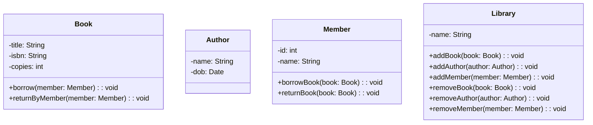
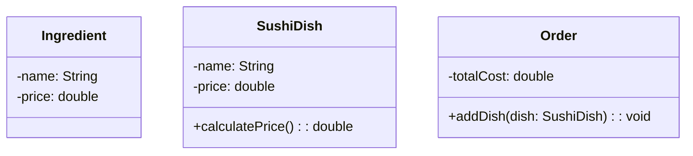

# Exercise Sheet: Modelling (e.g., UML class diagram)
[Link to German Version](./README.md)

In this exercise sheet, you will learn to read and write UML class and sequence diagrams to model programming projects.

**Notes:**
* I recommend to use the [Mermaid markdown extension](https://mermaid.js.org/syntax/classDiagram.html) to draw UML diagrams directly in markdown.
  * See, for reference, the [UML diagrams](#uml-class-diagram) in this README file
* Instead of adding all the getters and setters to the classes, you can use a convention to mark the respective fields, e.g.,
  * `«get/set»` denotes a private field with a public getter and setter.
  * `«get»` denotes a private (readonly) field with a public getter.

## Exercise: Library Management System

You are tasked with designing a Library Management System using object-oriented programming principles in Java. 
The system should be able to store information about books, authors, library members, and the library. 

Each book should have a title, an ISBN, an ordered set of authors, and the number of copies available. 
Each author should have a name, a date of birth, and a sorted set of books they have written. 
Each member should have a name, a unique ID, and a set of books they have borrowed. 
The system should also be able to handle multiple libraries, each with its own collection of books, authors, and members.

### Tasks

1. Given the class diagram provided below, add the necessary relationships between the classes using UML notation. Pay attention to roles, multiplicities, and descriptions. Submit your answers either in a markdown file `library_management.md`  or as a PDF file `library_management.pdf` in the root directory.
   * Bonus: use the [`Mermaid` markdown extension](https://mermaid.js.org/syntax/classDiagram.html) to draw the class diagram directly in markdown.
2. Implement the classes for books, authors, members, and libraries in Java in the `de.phl.programmingproject.librarymanagement` package. Each class should have appropriate constructors, getters, and setters.
   * **Note** that the relationships also need to be implemented.
3. Create a main method to test your Library Management System. In your test, create a few libraries, books, authors, and members and perform some borrow and return operations.

### UML Class Diagram



## Exercise: Sushi Ordering System

You are tasked with designing a sushi ordering system using object-oriented programming principles in Java. 
The system should be able to store information about the available sushi dishes and the ingredients used to make them.

Each sushi dish should consist of one or more ingredients and a price. 
The system should also be able to calculate the total cost of an order based on the selected dishes. 
In addition to this, the system should be able to handle multiple restaurants, each with its own set of sushi dishes and ingredients. 
In the restaurant, orders can be placed. Each order consists of at least one dish, with the same dish allowed multiple times per order.

### Tasks

1. Given the class diagram provided below, add the necessary relationships between the classes using UML notation.
2. Update the class diagram to include a `Restaurant` class that has a name and a list of sushi dishes and ingredients. Add the necessary associations between the classes to reflect this.
3. One ingredient crucial for sushi is rice. Discuss whether such a constraint can be modelled in UML class diagrams directly.
4. Upload your solution as a markdown file `sushi_ordering_system.md` or as a PDF file `sushi_ordering_system.pdf` in the root directory.
   * Bonus: use the [`mermaid` markdown extension](https://mermaid.js.org/syntax/classDiagram.html) to draw the class diagram directly in markdown.

### UML Class Diagram



## Exercise: Banking (UML Class Diagram Modelling)

In this exercise, you are going to model a simple banking system using UML class diagrams. 
You have been given the following Java classes (also available in the `de.phl.programmingproject.banking` package):

```java
public abstract class BankAccount {
    private final int accountNumber;
    private final Holder accountHolder;
    private double balance;
    
    public BankAccount(final int accountNumber, final Holder accountHolder, final double balance) {
        this.accountNumber = accountNumber;
        this.accountHolder = accountHolder;
        this.balance = balance;
    }
    
    public int getAccountNumber() {
        return accountNumber;
    }
    
    public Holder getAccountHolder() {
        return accountHolder;
    }
    
    public double getBalance() {
        return balance;
    }

    protected void setBalance(final double balance) {
        this.balance = balance;
    }
    
    public abstract void deposit(final double amount) throws IllegalArgumentException;
    
    public abstract void withdraw(final double amount) throws IllegalArgumentException;
}

public class SavingsAccount extends BankAccount {
    private final double interestRate;
    
    public SavingsAccount(final int accountNumber, final Holder accountHolder, final double balance, final double interestRate) {
        super(accountNumber, accountHolder, balance);
        this.interestRate = interestRate;
    }
    
    public double getInterestRate() {
        return interestRate;
    }
    
    public double calculateInterest() {
        return getBalance() * interestRate;
    }
    
    @Override
    public void withdraw(final double amount) throws IllegalArgumentException {
        if (getBalance() - amount < 0) {
            throw new IllegalArgumentException("Withdrawal amount exceeds balance.");
        }
        setBalance(getBalance() - amount);
    }

    @Override
    public void deposit(double amount) throws IllegalArgumentException {
        if (amount < 0) {
            throw new IllegalArgumentException("Deposit amount must be positive.");
        }
        setBalance(getBalance() + amount);
    }
}

public class CheckingAccount extends BankAccount {
    private final double overdraftLimit;
    
    public CheckingAccount(final int accountNumber, final Holder accountHolder, final double balance, final double overdraftLimit) {
        super(accountNumber, accountHolder, balance);
        this.overdraftLimit = overdraftLimit;
    }
    
    public double getOverdraftLimit() {
        return overdraftLimit;
    }
    
    @Override
    public void withdraw(final double amount) throws IllegalArgumentException {
        if (getBalance() - amount < -overdraftLimit) {
            throw new IllegalArgumentException("Withdrawal amount exceeds overdraft limit.");
        }
        setBalance(getBalance() - amount);
    }

    @Override
    public void deposit(double amount) throws IllegalArgumentException {
        if (amount < 0) {
            throw new IllegalArgumentException("Deposit amount must be positive.");
        }
        setBalance(getBalance() + amount);
    }
}

public class Bank {
    private final String name;
    private final Set<BankAccount> accounts;
    private final Set<Holder> holders;
    
    public Bank(final String name) {
        this.name = name;
        this.accounts = new HashSet<>();
        this.holders = new HashSet<>();
    }
    
    public String getName() {
        return name;
    }
    
    public void addAccount(final BankAccount account) {
        accounts.add(account);
    }
    
    public void addHolder(final Holder holder) {
        holders.add(holder);
    }
    
    public double getTotalBalance() {
        double total = 0;
        for (BankAccount account : accounts) {
            total += account.getBalance();
        }
        return total;
    }
    
    public Set<Holder> getHolders() {
        return holders;
    }
}

public class Holder {
    private final String name;
    private final Set<BankAccount> accounts;
    
    public Holder(final String name) {
        this.name = name;
        this.accounts = new HashSet<>();
    }
    
    public String getName() {
        return name;
    }
    
    public void addAccount(final BankAccount account) {
        accounts.add(account);
    }
    
    public Set<BankAccount> getAccounts() {
        return accounts;
    }
}
```

### Tasks

1. Draw a UML class diagram for the classes `BankAccount`, `SavingsAccount`, `CheckingAccount`, `Bank`, and `Holder`.
2. Represent the attributes as associations whenever it makes sense. Pay attention to multiplicities, roles, and descriptions.
3. Upload your solution as a markdown file `banking.md` or as a PDF file `banking.pdf` in the root directory.
   * Bonus: use the [`Mermaid` markdown extension](https://mermaid.js.org/syntax/classDiagram.html) to draw the class diagram directly in markdown.
4. In the UML class diagram, add new operation(s) to `Bank` for a holder to open a new bank account and remove the `addAccount` operation.
   * Add the updated UML class diagram to your solution.
5. Update the source code respectively.


## Exercise: Online Shopping Checkout

You are tasked with modeling an online shopping checkout process using UML sequence diagrams. 
The checkout process includes adding items to the shopping cart, entering payment and shipping information, and placing the order.

### Tasks

1. Create a UML sequence diagram that models the process of adding items to the shopping cart. Include the following actors: customer, shopping cart, and item. The customer should be able to add one or more items to the shopping cart and view the contents of the shopping cart.
2. Extend the sequence diagram from task 1 to model the process of entering payment and shipping information. Include the following actors: customer, shopping cart, payment gateway, and shipping provider. The customer should be able to enter payment and shipping information and view the order summary. If the payment information is invalid, the customer should be prompted to re-enter the information.
3. Extend the sequence diagram from task 2 to model the process of placing an order. Include the following actors: customer, shopping cart, payment gateway, shipping provider, and order management system. The customer should be able to place the order and receive a confirmation. If the order cannot be processed, the customer should be notified of the error.
4. Upload your solution as a markdown file `online_shopping_checkout.md` or as a PDF file `online_shopping_checkout.pdf` in the root directory.
   * Bonus: use the [`Mermaid` markdown extension](https://mermaid.js.org/syntax/sequenceDiagram.html) to draw the sequence diagram directly in markdown.

Note: The UML sequence diagram should include appropriate labels and messages for each step of the process.